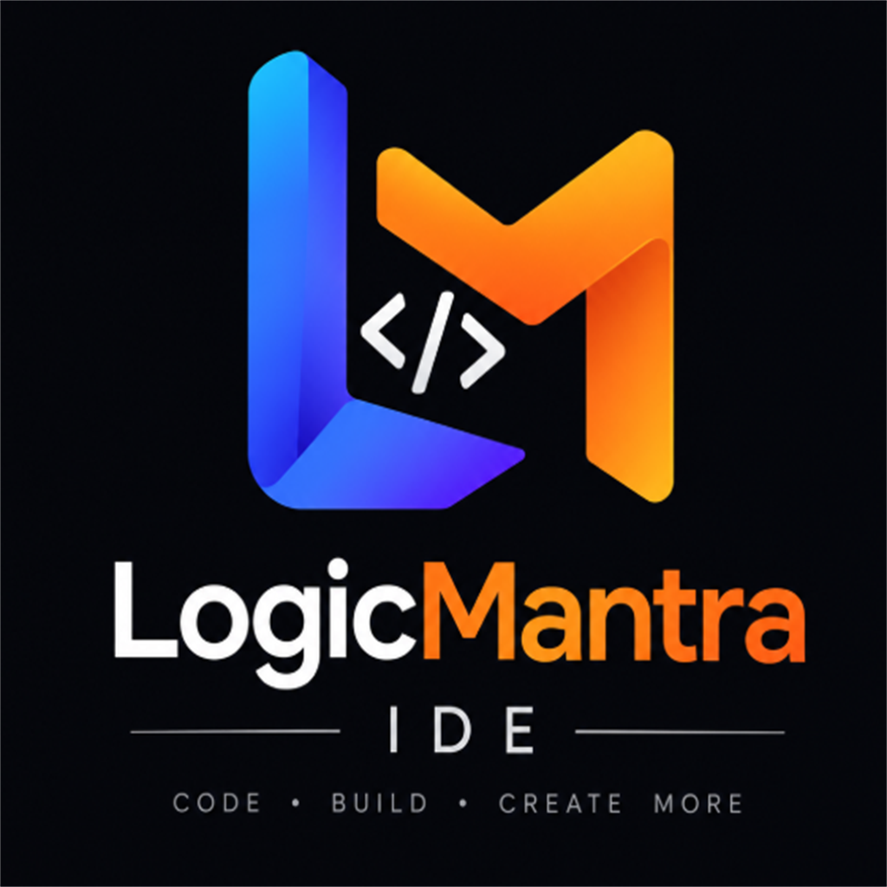

<h1 align="center">
  <a href="#"></a> LogicMantra IDE
</h1>

<p align="center">
  
  
  
</p>

<p align="center">
  <strong>Next-gen IDE for parallel agentic development.</strong><br/>
  Run multiple coding agents side-by-side — each in its own isolated git worktree, tracked in one place — with a realtime dashboard, an embedded browser, terminals, and a code knowledge graph.
</p>

---

## Overview

LogicMantra IDE is a rebranded, extended fork of the Orca IDE codebase. It is a desktop
application (Electron) that orchestrates **any CLI coding agent** (Claude Code, Codex, Cursor,
OpenCode, Pi, …) across **parallel git worktrees** so you can fan one prompt across several
agents, compare results, and merge the winner — all from one window.

The two headline additions over upstream:

1. **Full rebrand to LogicMantra** — product name "LogicMantra IDE", new logo, and localized
   UI (en / es / ja / ko / zh).
2. **Baton multi-agent coordination** — a one-click integration (Settings → Baton) that runs
   the full [`baton`](https://github.com/Rakshan001/Baton-Multi-Agent-) setup for the folder
   that is open in the IDE, starts the Baton daemon, and opens the knowledge-graph dashboard
   in the built-in browser tab.

---

## Features

| Capability | What it does |
|---|---|
| **Parallel worktrees** | Fan one prompt across N agents, each in its own git worktree; compare and merge the winner |
| **Any CLI agent** | Claude Code, Codex, Cursor, Grok, Copilot, OpenCode, MiMo, Amp, OpenClaude, Antigravity, Pi, oh-my-pi, Hermes, Devin, Goose, Auggie, Autohand, Charm, Cline, Codebuff, Command Code, Continue, Droid, Kilocode, Kimi, Kiro, Mistral Vibe, Qwen Code, Rovo Dev + any terminal agent |
| **Baton integration** | One-click `baton setup` + daemon + dashboard for the open folder (Settings → Baton) |
| **Terminal splits** | Ghostty-class terminals, infinite splits, scrollback that survives restarts |
| **Embedded browser** | Chromium tab inside the IDE; Design Mode sends real HTML/CSS/screenshot into an agent prompt |
| **GitHub & Linear** | Browse PRs, issues, boards in-app; open a worktree from any task |
| **SSH worktrees** | Run agents on a remote box with file editing, git, terminals, auto-reconnect, port-forwarding |
| **Annotate AI diffs** | Comment on any diff line and ship it back to the agent |
| **Drag files to agents** | Drag files or images into an agent prompt (autosave everywhere) |
| **Usage tracking** | Claude / Codex usage, rate-limit resets, account hot-swap |
| **Mobile companion** | Monitor and steer agents from your phone (iOS / Android) |
| **Computer Use** | Let agents operate desktop apps when a workflow needs real interaction |

---

## Repository layout

| Path | Contents |
|---|---|
| `src/main/` | Electron main process (IPC, windows, menus, baton daemon management) |
| `src/renderer/` | React UI (settings panes, dashboard, sidebar, i18n locales) |
| `src/preload/` | Preload bridge + typed `window.api` surface |
| `src/shared/` | Types + logic shared between main and renderer (incl. `baton-types.ts`) |
| `config/` | Build/verify scripts, electron-builder config, vitest, oxlint, i18n scripts |
| `resources/` | App icons, logo, onboarding media |
| `native/` | Native modules (windows-native-registry, etc.) |
| `mobile/` | Mobile companion app source |
| `docs/` | STYLEGUIDE + tracked reference docs (see `.gitignore` for the allow-list) |
| `brain.md` | **Living project memory — read before any edit, update after every milestone** |

---

## Key project files

- `brain.md` — the living memory / project state. **Mandatory first read** before editing.
- `AGENTS.md` — agent coding conventions (design system, lint, naming, cross-platform rules).
- `CLAUDE.md` — delegates to `AGENTS.md`.
- `PROJECT.md` — this project's detailed engineering documentation.

---

## Building

Prerequisites:

- Node.js **>= 24** (the app and Baton both require it)
- `pnpm` 9+
- On Windows: Visual Studio 2022 Build Tools with the "Desktop development with C++"
  workload (needed to compile `windows-native-registry`)

```bash
pnpm install
pnpm run typecheck        # all three tsconfigs
pnpm exec oxlint          # lint
pnpm run verify:localization-catalog   # i18n key parity
pnpm run build:win        # Windows installer → dist/logicmantra-windows-setup.exe
```

Build outputs land in `dist/`:

- `dist/logicmantra-windows-setup.exe` — NSIS installer
- `dist/win-unpacked/LogicMantra.exe` — unpacked app
- `latest.yml` + `.blockmap` — auto-update metadata

Platform notes: `win.executableName` is `LogicMantra` (no space in the exe filename; the space
lives in `productName`, which drives PE resources / NSIS / shortcuts). Linux uses
`logicmantra-ide`; macOS artifacts are named `logicmantra-macos-<arch>`.

---

## Baton integration

Baton is a Node ESM CLI (`baton-cli` 0.0.1, AGPL-3.0) that coordinates multiple agents on a
git repo: isolated worktrees, a realtime dashboard, a code knowledge graph, and session
handoff. It is installed globally (`npm link`) on this machine.

The IDE exposes it at **Settings → Baton**:

- **Start Baton** — runs the full `baton setup --yes --local --serve <open-folder>`, starts the
  daemon on `http://127.0.0.1:7077`, and opens the dashboard in a browser tab. It also
  **auto-installs the full skill catalog** (`GET /api/skills` → `POST /api/skills/:id/install`
  with `agent: "all"`), so every writable agent has every Baton skill ready; the pane shows
  "Skills installed: N / M".
- **Open Dashboard** — opens `http://127.0.0.1:7077` in a tab.
- **Stop** — stops the daemon (kills the process listening on the Baton port).

Guarantees implemented in `src/main/ipc/baton-daemon.ts`:

- The dashboard always shows the **knowledge graph of the folder that is open in the IDE**.
  Before reusing a daemon already running on port 7077, the IDE verifies — via
  `GET /api/meta` — which repo it serves; if it serves a *different* folder, the IDE finds the
  process listening on the port (`netstat`/`lsof`), stops it, and starts a fresh daemon for the
  correct folder. This fixes the "graph shows another folder's knowledge" bug.
- Tolerates "already set up / already running": an existing setup or daemon for the same folder
  is reused; a daemon for a different folder is replaced.
- The dashboard UI is restyled to match the IDE design (zinc palette, Geist typeface); the
  built assets are served from the Baton package's `web/dist`.

See `brain.md` → "Baton integration notes" for the full design and command reference.

---

## Documentation & memory

- `brain.md` is the canonical project memory. It is updated after every milestone and must be
  read top-to-bottom at the start of every session.
- `PROJECT.md` holds the detailed engineering write-up (stack, build, integration, git/GitHub
  workflow).
- `docs/STYLEGUIDE.md` is the design-system authority for all UI work.

---

## License

LogicMantra IDE is free and open source under the [MIT License](LICENSE).

> The upstream Orca codebase is MIT-licensed; the bundled `baton` CLI is AGPL-3.0 and runs as a
> separate, on-demand child process — it is not distributed as part of this repository.